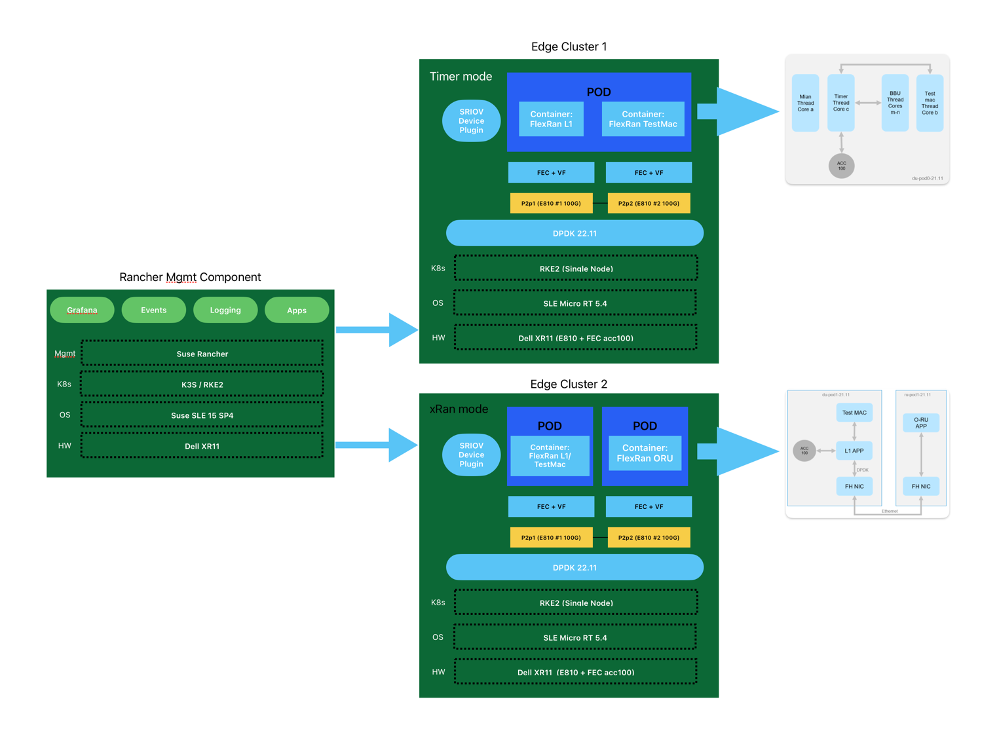
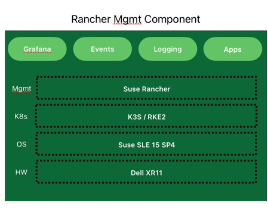
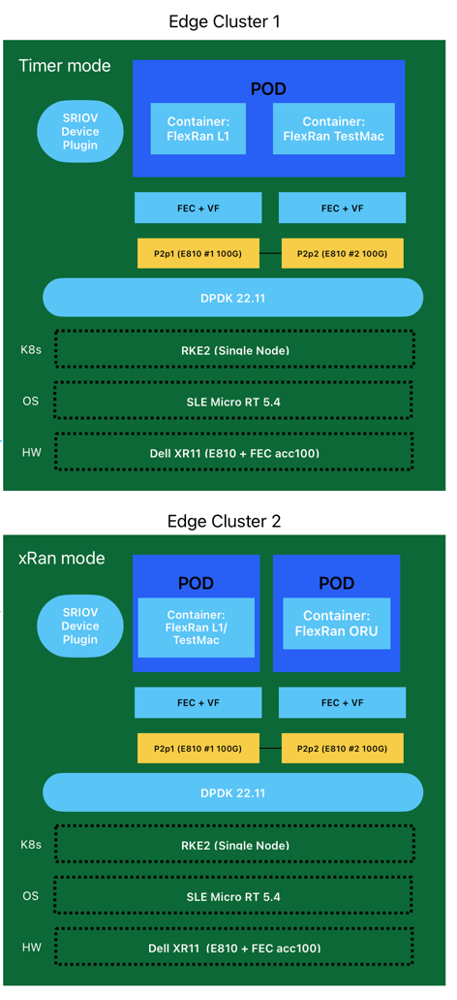
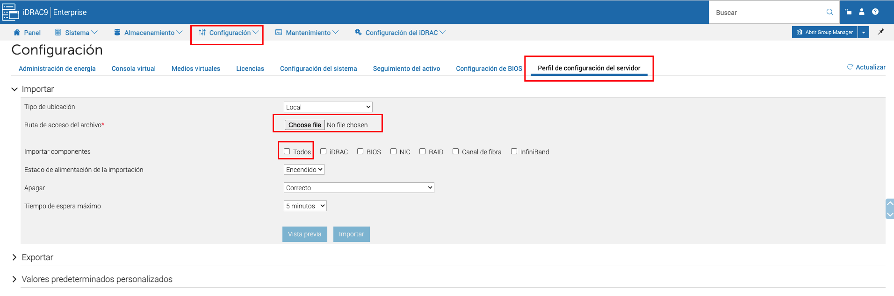
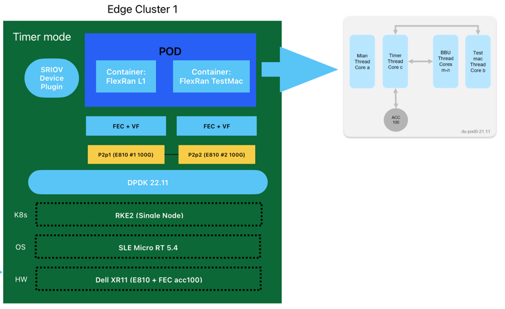
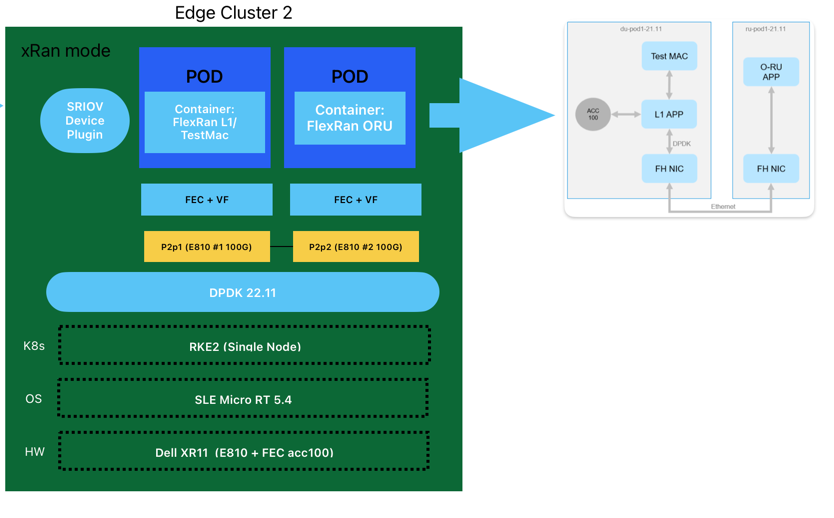
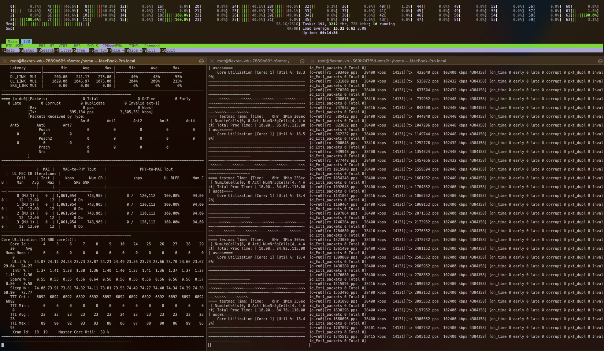

## Introduction

Intel® FlexRAN is a reference implementation for a virtualized 4G and 5G RAN stack. It's main purpose is to illustrate how to achieve real-time performance of a virtualized 4G or 5G PHY and MAC layer on an Intel-based hardware architecture, using Intel® Xeon® Scalable processors, the Intel® Advanced Vector Extensions 512 `Intel® AVX 512` instruction set and a number of other hardware acceleration features and technologies found in modern Intel Xeon family processors. While some vendors of CloudRAN and in particular O-RAN software merely use it as inspiration, some vendors adopt Intel FlexRAN directly as part of their product.
This article describes how to deploy FlexRAN on the SUSE Adaptive Telco Infrastructure Platform (ATIP) running on bare-metal infrastructure as a Containerized Network Function (CNF). In the ATIP architecture, the runtime stack consists of [SUSE Linux Enterprise Micro](https://www.suse.com/products/micro/) and Rancher Kubernetes Engine v2 (RKE2) and we are using [Rancher](https://www.rancher.com/) to perform cluster and application provisioning, life cycle management, application resource management and collection of telemetry data with role-based access control.
The example RAN deployment option considered here is the [ORAN Alliance 7-2x lower-level split](https://www.o-ran.org/blog/20-new-o-ran-specifications-have-been-released-since-june-2020), which in a nutshell means that the lower layer PHY processing for uplink and downlink (such as Cyclic Prefix addition/removal, iFFT/FFT, calculation of beamforming coefficients and PRACH pre-filtering) is performed in the Radio Unit (RU), and upper layer PHY processing as well as all MAC layer processing is performed in the Distributed Unit (DU). When DU and RU are deployed in different Kubernetes pods, this constitutes an excellent test for a telco cloud platform, as it requires near-realtime processing and transmission of fronthaul traffic over physical network interfaces, which is only possible with careful orchestration of a number of telco-grade platform features, as we will detail further below.

With this cloud-native setup, we can identify the appropriate configuration of the `Suse Edge ATIP` (Adaptive Telco Infrastructure Platform) stack. Also, it demostrates that telecom containerised applications like DU/CU can be run on RKE2 cluster on top of the SLE Micro RT OS taking advantage of the accelerator cards. In addition, we show that we are applying the full power and potential of the accelerator card and CPU.

> For more information about Intel FlexRan, see the official [Intel FlexRan website](https://www.intel.com/content/www/us/en/developer/topic-technology/edge-5g/tools/flexran.html)
>
> For more infomration about Suse ATIP, see the official [Suse Edge ATIP documentation](https://suse-edge.github.io/docs/product/atip/introduction)


## Architecture

The architecture is based on the following components:

- Rancher Management Cluster: This component will be used to manage the lifecycle of the RKE2 clusters hosting the FlexRAN solution, as well as the monitoring platform based on the Rancher monitoring stack (Grafana and Prometheus installed on the downstream cluster). This cluster is based on a single-node RKE2 cluster on top of SLE Micro.
- Edge Cluster 1: This cluster will be used to deploy the `FlexRan Timer Mode tests`. This cluster is based on a single-node RKE2 cluster on top of SLE Micro RT Operating System.
- Edge Cluster 2: This cluster will be used to deploy the `FlexRan Xran Mode tests`. This cluster is based on a single-node RKE2 cluster on top of SLE Micro RT Operating System.

> Note: The FlexRan tests could be deployed on the same edge cluster, but just for clarity and simplicity in the article, we will deploy them on different clusters.




## Hardware and Software components

### Hardware
The hardware used for this article is based on the following components:

- Dell PowerEdge XR11 servers
- Intel XEON Gold 6338N 2.2G
- 8 x 32GB RDIMM 3200MT/S
- 2 x 480GB SSD SATA Disk
- Intel E810-CQDA2 Dual Port 100GbE QSFP28
- ACC100 FEC Accelerator card

### Software
The software used for this article is based on the following components:

- Operating system: `SLE Micro 5.4`
- Kernel Real Time: `5.14.21-150400.15.11-rt` 
- RKE2 version: `v1.25.9+rke2r1`
- CNI plugins: `Multus 0.3.1` and  `Calico v3.25.0`
- Rancher release: `rancher-stable v2.7.5`
- Dpdk version: `22.11`
- SRIOV upstream `v3.5.1`

### Flexran
The FlexRan deployment used for this article is based on the following components:

- FlexRAN version: `22.07` using [pre-defined containers](https://hub.docker.com/r/intel/flexran_vdu) from Intel.
- Intel OneAPI Base Toolkit: `2022.1.2.146`

## Rancher Management Cluster

In our case, the Rancher management cluster will be used to manage the lifecycle of the RKE2 edge clusters deployed for the FlexRAN solution, as well as the monitoring platform based on Grafana and Prometheus.



> The operating system installation steps have been omitted for the sake of brevity. There are no special performance-related configuration settings required for the OS on the management cluster.
> For more information about how to install the Operating System, see the next [link](https://suse-edge.github.io/docs/product/atip/management-cluster)

### RKE2 Cluster Installation on the Management Server

Once you have the Operating System installed, you can proceed with the Rancher installation. First, we will install a RKE2 cluster and then, the Rancher Helm chart to install the Rancher management cluster.

1. Run the RKE2 installer:

`curl -sfL https://get.rke2.io | sh -`

if you want to install a particular version, the `INSTALL_RKE2_VERSION` variable can be used as:

`curl -sfL https://get.rke2.io | INSTALL_RKE2_VERSION="v1.25.9+rke2r1" sh -`

> For more information about the installation, please refer to the documentation: https://docs.rke2.io/install/install_options/

2. Enable and start the rke2-server service:

`systemctl enable --now rke2-server.service`

In case you want to run the RKE2 agent (in case you need to add more nodes designated to run your apps and services), you can follow the next steps:

1. Run the RKE2 installer:

`curl -sfL https://get.rke2.io | INSTALL_RKE2_TYPE="agent" sh -`

2. Configure the config.yaml file located in `/etc/rancher/rke2/` with the following content:
```yaml
server: https://<server>:9345
token: <token from server node>
```

3. Enable and start the service:

`systemctl enable --now rke2-agent.service`

### Rancher Manager Install

Rancher is installed using the Helm package manager for Kubernetes.
Helm charts provide templating syntax for Kubernetes YAML manifest documents. With Helm, we can create configurable deployments instead of just using static files.

> This section covers the deployment of Rancher on the management cluster.
>
> For more information about the Rancher manager installation, please refer to the documentation: https://ranchermanager.docs.rancher.com/v2.7/pages-for-subheaders/install-upgrade-on-a-kubernetes-cluster

1. Add the Helm repository

There are three Rancher manager releases available to be added as a Helm repository for Rancher. In our case, we will use the `rancher-stable` because it's the release recommended for production environments, but you could use `rancher-latest` or `rancher-alpha` if you want. Also, there is a `rancher primer` release that is the enterprise version of Rancher.

`helm repo add rancher-stable https://releases.rancher.com/server-charts/stable`

> If you don't have `helm` installed previously, you could install it using the following command:
>
> `curl -fsSL https://raw.githubusercontent.com/helm/helm/master/scripts/get-helm-3 |bash`
>

2. Choose your SSL Configuration

The Rancher management server is designed to be secure by default and requires SSL/TLS configuration.

There are three recommended options for SSL/TLS configuration:
- Rancher-generated TLS certificate
- Let's Encrypt
- Bring your own certificate

> For more information about the SSL/TLS configuration, please refer to the documentation: https://ranchermanager.docs.rancher.com/v2.7/pages-for-subheaders/install-upgrade-on-a-kubernetes-cluster/#3-choose-your-ssl-configuration

In our case we will use the Rancher-generated TLS certificate. This requires `cert-manager` to be deployed in the cluster as::

```shell 
helm repo add jetstack https://charts.jetstack.io
helm repo update
helm install cert-manager jetstack/cert-manager \
		--namespace cert-manager \
		--create-namespace \
		--set installCRDs=true \
		--version v1.11.1 
```

Once you've installed cert-manager, you can verify the pods are running:
`kubectl get pods --namespace cert-manager`


3. Install Rancher with Helm using the following command modifying the `<hostname>` and `<bootstrapPassword>` values to fit your environment:

```shell 
helm install rancher rancher-stable/rancher \
        --namespace cattle-system \
        --create-namespace \
        --set hostname=<hostname> \
        --set bootstrapPassword=<bootstrapPassword> \
        --set replicas=1 \
        --set global.cattle.psp.enabled=false
```

4. Verify the Rancher installation

You should wait a few minutes for Rancher to be rolled out:

`kubectl -n cattle-system rollout status deploy/rancher`

## Edge Cluster deployment

This section covers the bare-metal provisioning and installation of the edge cluster nodes in order to deploy the FlexRan tests. In our case, we will deploy two edge clusters, one for the FlexRan Timer Mode tests and another one for the FlexRan Xran Mode tests.
The configuration of the edge cluster nodes is based on the following components, and it will be the same for the two edge clusters:



### BIOS Configuration for Dell PowerEdge XR11

The BIOS and NIC configuration used for this article based on the [hardware](./2023-07-28-flexran.md#hardware) shown above, could be imported directly using the [Dell PowerEdge XR11 BIOS Exported Configuration File](2023-07-29-flexran-images/system-config.xml).
In order to import the configuration file, you need to do it using the idrac web interface:



> *Note*: This configuration depends on the hardware vendor, so please, check with your hardware vendor the best configuration to be used.

Pay special attention to the parameters suggested here as some of them could dramatically increase or decrease the performance of the tests being executed.
The next table shows the recommended configuration as a reference for the most common hardware vendors:

| Option                                         | Value            | Description |
|------------------------------------------------|------------------| ----------- |
| Workload Profile                               | Telco Optimized  | Telco profile to optimize the performance in the hardware. |
| Boot Performance Mode                          | Max. Performance | Maximize the performance in the boot process. |
| Hyper- Threading (Logical Proccesor)           | Enable           | This option enables Intel® Hyper-Threading Technology for logical processor enabling and converting processor cores (pCores) to logical cores (lCores). |
| Virtualization Technology (XAPIC)              | Enable           | This option is for Extended Advanced Programmable Interrupt Controller (xAPIC) support for the Intel® Virtualization Technology for Directed I/O (Intel® VT-d) feature. |
| uncore frequency scaling                       | Disable          | If enabled, Uncore Frequency Scaling (UFS) allows the uncore to operate at a lower frequency when the Power Control Unit (PCU) has detected low utilization. Conversely, UFS allows the uncore to operate at a higher frequency when the PCU has detected high utilization.|
| CPU P-State Control (EIST PSD Function         | HW_ALL           | optimization of the voltage and CPU fequency during operation|
| CPU C-State Control                            | Disable          | This option is for the CPU C-State Control feature, which provides power savings by placing the processor into lower power states when the processor is idle. |
| CPU C1E Support                                | Disable          | This option is for the CPU Enhanced Halt (C1E) feature, which provides power savings by placing the processor into a low power state when the processor is idle. |
| AVX License Pre-Grant                          | Enable           | If enabled, this option enables the pre-grant license level selection based on workload with the AVX ICCP Pre-Grant Level option.|
| AVX ICCP Pre- Grant Level                      | Level 5          | This option selects a workload level for the Intel® Advanced Vector Extensions (Intel® AVX): Intel® AVX-512 Heavy |
| AVX P1                                         | Level 2          |This option serves a dual purpose: 1 -Specifies the base P1 ratio for Intel® Streaming SIMD Extensions (Intel® SSE) or Intel® AVX workloads. 2- Pre-grants a license level based on the workload level.|
| Energy Efficient Turbo                         | Disable          | This option allows entry into the Intel® Turbo Boost Technology frequency when the Power Control Unit (PCU) has detected high utilization.|
| Turbo Mode                                     | Enable | Enabling this Intel® Turbo Boost Technology mode setting allows the CPU cores to operate at higher than the rated frequency.|
| GPSS timer                                     | 0us              | This option allows the reduction of the Global P-State Selection (GPSS) timer to be set from: 0 μs to 500 μs|
| LLC prefetch                                   | Enable | This option enables Last Level Cache (LLC) hardware prefetch logic. |
| Frequency Prioritization (RAPL Prioritization) | Disable | This setting controls whether the Running Average Power Limit (RAPL) balancer is enabled. If enabled, it activates per core power budgeting.|
| Hardware P-States                              | Native with no Legacy Support | When enabled, this option allows the hardware to choose a Performance State (P-State) based on an OS request (that is, a legacy P-State).| 
| EPP enable3                                    | Disable|When this option is enabled, the system uses the energy performance bias register for the Energy Performance Preference (EPP) input to make decision on Performance State (P-State) or Processor Core Idle State (C-State) transitions.|
| APS Rocketing                                  | Disable | Rocketing mechanism in the HWP p-state selection for pcode algorithm. Rocketing enables the core ratio to jump to max turbo instantaneously as opposed to a smooth ramp| 
| Scalability                                    | Disable | Core Performance to frequency scalability based on optimizations in the CPU.|
| Native ASPM                                    | Disable | ASPM off not controlled by BIOS or OS.|
| Power Performance Tuning                       | OS Controls EPB | This option selects the BIOS or OS that controls the Energy Performance Bias (EPB) functionality.|
| Workload Configuration                         | I/O sensitive | This option allows the system power and performance profile to be set to favor compute intensive workload or I/O sensitive workload.| 
| Dynamic L1                                     | Disable | This option applies only to the package-level setting to allow dynamically entering the lower power link state L1.|
| Set Fan Profile                                |Performance | This option allows the fan profile to be set to Performance, Balanced, or Quiet.|
| Cooling Configuration - Fan Speed Offset       | Medium| This option allows the fan speed offset to be set to Low, Medium, or High.|


### OS Installation

For this example, we will assume the SLE Micro RT 5.4 operating system has been already installed on the baremetal host used to deploy the edge clusters. To verify the `Real Time Kernel` version used, you can use the following command (pay attention to the `-rt` suffix):

```shell
uname -r
5.14.21-150400.15.11-rt
```

>If you want to download the SLE Micro RT 5.4 ISO, you can use the following link paying special attention to the `-RT` in the image name, once you've logged in with your SUSE credentials: [Download SLE Micro RT from Suse Customer Center](https://www.suse.com/download/sle-micro/)

> For more information about how to install the operating system SLE Micro RT, see the next [link](https://suse-edge.github.io/docs/product/atip/management-cluster#os-install)


### OS Configuration and Tuning

Once you have the Operating System installed, you can proceed with the Operating System configuration. For this article, we will configure the Operating System using the next steps:

1. CPU Tuned Configuration

The first thing is to create a profile for the CPU cores we want to isolate. In this case, we will isolate the cores 1-30 and 33-62 to be used by FlexRan, keeping also some cores available for the system.

```
echo "export tuned_params" >> /etc/grub.d/00_tuned

echo "isolated_cores=1-30,33-62" >> /etc/tuned/cpu-partitioning-variables.conf

systemctl enable tuned; systemctl start tuned

tuned-adm profile cpu-partitioning
```

2. Grub Configuration

We need to modify some grub options to be able to do the CPU isolation as well as another important parameters for the CPU performance on this scenario.

The following options have to be customized:

| parameter | value | description                                                                                          |
|-----------|-------|------------------------------------------------------------------------------------------------------|
| isolcpu| 1-30,33-62| Isolate the cores 1-30 and 33-62                                                                     |
| skew_tick| 1 | Allows the kernel to skew the timer interrupts across the isolated CPUs.                             |
| nohz| on | Allows the kernel to run the timer tick on a single CPU when the system is idle.                     |
| nohz_full| 1-30,33-62 | kernel boot parameter is the current main interface to configure full dynticks along with CPU Isolation. |
| rcu_nocbs| 1-30,33-62 | Allows the kernel to run the RCU callbacks on a single CPU when the system is idle.                  |
| kthread_cpus| 0,31,32,63 | Allows the kernel to run the kthreads on a single CPU when the system is idle.                       |
| irqaffinity| 0,31,32,63 | Allows the kernel to run the interrupts on a single CPU when the system is idle.                     |
|processor.max_cstate| 1 | Prevents the CPU from dropping into a sleep state when idle                                          |   
|intel_idle.max_cstate| 0 | Disables the intel_idle driver and allows acpi_idle to be used                                       |
| iommu       | pt         | Allows to use vfio for the dpdk interfaces                                                           |
| intel_iommu | on         | Enables to use vfio for VFs.                                                                         |
| hugepagesz | 1G    | Allows to set the size of huge pages to 1G                                                           |
| hugepages | 40    | Number of hugepages defined before                                                                   |
| default_hugepagesz| 1G | Default value to enable huge pages                                                                   |

> For mor information about theses parameters, please refer to the next [link](https://suse-edge.github.io/docs/product/atip/features)

With the values showed above, we are isolating 60 cores, and we are using 4 cores for the OS.

We can modify the grub config as follows:

```
vi /etc/default/grub
    GRUB_CMDLINE_LINUX="intel_iommu=on intel_pstate=passive processor.max_cstate=1 intel_idle.max_cstate=0 iommu=pt usbcore.autosuspend=-1 selinux=0 enforcing=0 nmi_watchdog=0 crashkernel=auto softlockup_panic=0 audit=0 mce=off hugepagesz=1G hugepages=40 hugepagesz=2M hugepages=0 default_hugepagesz=1G kthread_cpus=0,31,32,63 irqaffinity=0,31,32,63 isolcpu=1-30,33-62 skew_tick=1 nohz_full=1-30,33-62 rcu_nocbs=1-30,33-62 rcu_nocb_poll"

transactional-update grub.cfg
```

To validate that the parameters are applied after reboot, you could check:

```
cat /proc/cmdline
```

3. Install the dependencies.

```
transactional-update shell

cat > /etc/zypp/repos.d/flexran-dependencies.repo << EOF
[home_amorgante_branches_home_dpitchumani]
name=Branch project for package DPDK-22.11 (15.4)
type=rpm-md
baseurl=https://download.opensuse.org/repositories/home:/amorgante:/branches:/home:/dpitchumani/15.4/
gpgcheck=1
gpgkey=https://download.opensuse.org/repositories/home:/amorgante:/branches:/home:/dpitchumani/15.4/repodata/repomd.xml.key
enabled=1

[home_amorgante]
name=home:amorgante (15.4)
type=rpm-md
baseurl=https://download.opensuse.org/repositories/home:/amorgante/15.4/
gpgcheck=1
gpgkey=https://download.opensuse.org/repositories/home:/amorgante/15.4/repodata/repomd.xml.key
enabled=1
EOF

suseconnect -p PackageHub/15.4/x86_64
zypper in ./htop.rpm ./igbuiokmprt.rpm ./igbuioueficert.rpm ./libatomic1.rpm ./libdpdk.rpm
zypper in dpdk dpdk-tools pf-bb-config pciutils 

exit
```

4. CPU Performance

Further improve the deterministic and power efficiency:

`cpupower frequency-set -g performance`

Set cpu core frequency to 2.6Ghz which is the maximum allowed in our case (based on the hardware):

`cpupower frequency-set -u 2500000`

`cpupower frequency-set -d 2500000`

Set cpu uncore to fixed – maximum allowed. Disable c6 and c1e in order to disable the powersaving features in your system (only if enabled):

`cpupower idle-set -d 3`

`cpupower idle-set -d 2`

> In case you've got the following message `Idlestate 3 not available on CPU x` you can ignore it, because that's means that the idle state is already disabled.


5. Check the CPU performance

You should see the driver intel_cpufreq and the governor performance with a frequency range between 2.5 and 2.6Ghz:
```
cpupower frequency-info
...
analyzing CPU 0:
  driver: intel_cpufreq
  CPUs which run at the same hardware frequency: 0
  CPUs which need to have their frequency coordinated by software: 0
  maximum transition latency: 20.0 us
  hardware limits: 800 MHz - 3.50 GHz
  available cpufreq governors: ondemand performance schedutil
  current policy: frequency should be within 800 MHz and 3.50 GHz.
                  The governor "performance" may decide which speed to use
                  within this range.
  current CPU frequency: Unable to call hardware
  current CPU frequency: 2.60 GHz (asserted by call to kernel)
  boost state support:
    Supported: yes
    Active: yes
...
```

### RKE2 Cluster Installation

The RKE2 installation could be done creating a new cluster from the Rancher UI or importing an existing RKE2 cluster to Rancher.
In our case, for brevity we will install a new RKE2 Cluster from scratch importing it after that directly into Rancher.

> If you want to install the RKE2 cluster from the Rancher UI you can follow [this document](https://suse-edge.github.io/docs/product/atip/edge-site#edge-site-definition)

1. Run the RKE2 installer:

In this scenario we use the `v1.25.9+rke2r1` version as:
```
curl -sfL https://get.rke2.io | INSTALL_RKE2_VERSION="v1.25.9+rke2r1" sh -
```

2. Create the `/etc/rancher/rke2/config.yaml` file (and the rancher/rke2 directory) with the following content to enable `Multus + Calico` CNI plugins:

```yaml
cni:
  - multus
  - calico
```

3. Start rke2-server service:
``` 
systemctl daemon-reload && systemctl enable --now rke2-server
```

4. Check the installation

Make sure the calico and multus pods are running:
```
$ kubectl get pods -A
NAMESPACE         NAME                                                    READY   STATUS      RESTARTS   AGE
calico-system     calico-kube-controllers-687bc88ddf-6dp4r                1/1     Running     0          3m13s
calico-system     calico-node-jkhx9                                       1/1     Running     0          3m13s
calico-system     calico-typha-869bd9756d-ft4bs                           1/1     Running     0          3m13s
kube-system       cloud-controller-manager-xr11-2                         1/1     Running     0          3m49s
kube-system       etcd-xr11-2                                             1/1     Running     0          3m47s
kube-system       helm-install-rke2-calico-crd-q2cp2                      0/1     Completed   0          3m36s
kube-system       helm-install-rke2-calico-nv4rn                          0/1     Completed   1          3m36s
kube-system       helm-install-rke2-coredns-55k9x                         0/1     Completed   0          3m36s
kube-system       helm-install-rke2-ingress-nginx-fvmp4                   0/1     Completed   0          3m36s
kube-system       helm-install-rke2-metrics-server-d2dhz                  0/1     Completed   0          3m36s
kube-system       helm-install-rke2-multus-mm59z                          0/1     Completed   0          3m36s
kube-system       helm-install-rke2-snapshot-controller-crd-vbcjb         0/1     Completed   0          3m36s
kube-system       helm-install-rke2-snapshot-controller-jw6pk             0/1     Completed   0          3m36s
kube-system       helm-install-rke2-snapshot-validation-webhook-w5sj2     0/1     Completed   0          3m36s
kube-system       kube-apiserver-xr11-2                                   1/1     Running     0          3m53s
kube-system       kube-controller-manager-xr11-2                          1/1     Running     0          3m51s
kube-system       kube-proxy-xr11-2                                       1/1     Running     0          3m48s
kube-system       kube-scheduler-xr11-2                                   1/1     Running     0          3m51s
kube-system       rke2-coredns-rke2-coredns-6b9548f79f-bc54n              1/1     Running     0          3m26s
kube-system       rke2-coredns-rke2-coredns-autoscaler-57647bc7cf-bfggl   1/1     Running     0          3m26s
kube-system       rke2-ingress-nginx-controller-6vsgf                     1/1     Running     0          2m18s
kube-system       rke2-metrics-server-7d58bbc9c6-qjkvr                    1/1     Running     0          2m33s
kube-system       rke2-multus-ds-4zsqr                                    1/1     Running     0          3m26s
kube-system       rke2-snapshot-controller-7b5b4f946c-rhtxn               1/1     Running     0          2m32s
kube-system       rke2-snapshot-validation-webhook-7748dbf6ff-cfmpm       1/1     Running     0          2m1s
tigera-operator   tigera-operator-7bd6b54cb8-2jm92                        1/1     Running     0          3m23s
```


### ACC100 Configuration

The ACC100 accelerator card is a PCIe card that provides hardware acceleration for the Forward Error Correction (FEC) algorithm. This card is used by the FlexRan library to improve the performance of the DU/CU components.

1. Load the `igb_uio` kernel module

> During the OS configuration section we have installed the `igb` driver, `dpdk` as well as the `pf-bb-config` tool [requirements](./2023-07-28-flexran.md#os-configuration-and-tunning)

We will start configuring the Accelerator Card by loading the `ibg_uio` and the `vfio-pci` module.

```
modprobe igb_uio
modprobe vfio-pci
```

2. Get the interface ACC100 PCI address:

```
/sbin/lspci | grep -i acc
8a:00.0 Processing accelerators: Intel Corporation Device 0d5c
```


3. Bind the Physical Function (PF) with the `igb_uio` driver:


```
dpdk-devbind.py -b igb_uio 0000:8a:00.0
```

4. Create 2 Virtual Functions (vfs) from the PF and bind them with `vfio-pci` driver:

```
echo 2 > /sys/bus/pci/devices/0000:8a:00.0/max_vfs
dpdk-devbind.py -b vfio-pci 0000:8b:00.0
```

5. Configure acc100 using the `pf-bb-config` tool:
The Physical Function (PF) Baseband Device (BBDEV) Configuration Application (`pf_bb_config`) provides a means to configure a baseband device at the host level. The program accesses the configuration space and sets various parameters through memory-mapped I/O (MMIO) reads and writes.
The parameters are parsed from a given configuration file (with .cfg extensions) that is specific to a particular baseband device, although they follow same format.

> For more information about the pf-bb-config tool, please refer to the [documentation](https://github.com/intel/pf-bb-config)

```
pf_bb_config ACC100 -c /opt/pf-bb-config/acc100_config_vf_5g.cfg

Tue Jun  6 10:49:20 2023:INFO:Queue Groups: 2 5GUL, 2 5GDL, 2 4GUL, 2 4GDL
Tue Jun  6 10:49:20 2023:INFO:Configuration in VF mode
Tue Jun  6 10:49:21 2023:INFO: ROM version MM 99AD92
Tue Jun  6 10:49:21 2023:WARN:* Note: Not on DDR PRQ version  1302020 != 10092020
Tue Jun  6 10:49:21 2023:INFO:PF ACC100 configuration complete
Tue Jun  6 10:49:21 2023:INFO:ACC100 PF [0000:8a:00.0] configuration complete!
```

6. Check the new VFs created are available and ready to be used by the FlexRan library:

```
dpdk-devbind.py -s
...
Baseband devices using DPDK-compatible driver
=============================================
0000:8a:00.0 'Device 0d5c' drv=igb_uio unused=vfio-pci
0000:8b:00.0 'Device 0d5d' drv=vfio-pci unused=igb_uio

Other Baseband devices
======================
0000:8b:00.1 'Device 0d5d' unused=igb_uio,vfio-pci
...
```


### DPDK Configuration

The Data Plane Development Kit (DPDK) is a set of data plane libraries and network interface controller drivers for fast packet processing. It is designed to run on any processors. In our case, we will use the DPDK libraries to accelerate the performance of the FlexRan library.
Let's start to create some VFs to be available for the FlexRan workloads:

1. Create the VF PCI addresses in the node:

In this section we will create 4 VFs for each PF (2 PFs in total for the dual port E810 100G interface) binding to the vfio driver, and then, we will assign a MAC address to each VF. 
The MAC address is used by the FlexRan library to identify the VFs. This is not a mandatory step, but then, you will need to modify the FlexRan Docker entrypoint script in order to adapt the MAC addresses to the VFs created. We will talk more about the docker entrypoint script in the next section.

```
echo 4 > /sys/bus/pci/devices/0000:51:00.0/sriov_numvfs
ip link set p2p1 vf 0 mac 00:11:22:33:00:00
ip link set p2p1 vf 1 mac 00:11:22:33:00:10
ip link set p2p1 vf 2 mac 00:11:22:33:00:20
ip link set p2p1 vf 3 mac 00:11:22:33:00:30
echo 4 > /sys/bus/pci/devices/0000:51:00.1/sriov_numvfs
ip link set p2p2 vf 0 mac 00:11:22:33:00:01
ip link set p2p2 vf 1 mac 00:11:22:33:00:11
ip link set p2p2 vf 2 mac 00:11:22:33:00:21
ip link set p2p2 vf 3 mac 00:11:22:33:00:31
dpdk-devbind.py -b vfio-pci 0000:51:01.0 0000:51:01.1 0000:51:01.2 0000:51:01.3 0000:51:11.0 0000:51:11.1 0000:51:11.2 0000:51:11.3
```

2. Review the configuration:

``` 
dpdk-devbind.py -s

Network devices using DPDK-compatible driver
============================================
0000:51:01.0 'Ethernet Adaptive Virtual Function 1889' drv=vfio-pci unused=iavf,igb_uio
0000:51:01.1 'Ethernet Adaptive Virtual Function 1889' drv=vfio-pci unused=iavf,igb_uio
0000:51:01.2 'Ethernet Adaptive Virtual Function 1889' drv=vfio-pci unused=iavf,igb_uio
0000:51:01.3 'Ethernet Adaptive Virtual Function 1889' drv=vfio-pci unused=iavf,igb_uio
0000:51:01.0 'Ethernet Adaptive Virtual Function 1889' drv=vfio-pci unused=iavf,igb_uio
0000:51:11.1 'Ethernet Adaptive Virtual Function 1889' drv=vfio-pci unused=iavf,igb_uio
0000:51:21.2 'Ethernet Adaptive Virtual Function 1889' drv=vfio-pci unused=iavf,igb_uio
0000:51:31.3 'Ethernet Adaptive Virtual Function 1889' drv=vfio-pci unused=iavf,igb_uio

Network devices using kernel driver
===================================
0000:19:00.0 'BCM57504 NetXtreme-E 10Gb/25Gb/40Gb/50Gb/100Gb/200Gb Ethernet 1751' if=em1 drv=bnxt_en unused=igb_uio,vfio-pci *Active*
0000:19:00.1 'BCM57504 NetXtreme-E 10Gb/25Gb/40Gb/50Gb/100Gb/200Gb Ethernet 1751' if=em2 drv=bnxt_en unused=igb_uio,vfio-pci
0000:19:00.2 'BCM57504 NetXtreme-E 10Gb/25Gb/40Gb/50Gb/100Gb/200Gb Ethernet 1751' if=em3 drv=bnxt_en unused=igb_uio,vfio-pci
0000:19:00.3 'BCM57504 NetXtreme-E 10Gb/25Gb/40Gb/50Gb/100Gb/200Gb Ethernet 1751' if=em4 drv=bnxt_en unused=igb_uio,vfio-pci
0000:51:00.0 'Ethernet Controller E810-C for QSFP 1592' if=eth13 drv=ice unused=igb_uio,vfio-pci
0000:51:00.1 'Ethernet Controller E810-C for QSFP 1592' if=rename8 drv=ice unused=igb_uio,vfio-pci

Baseband devices using DPDK-compatible driver
=============================================
0000:8a:00.0 'Device 0d5c' drv=igb_uio unused=vfio-pci

Other Baseband devices
======================
0000:8b:00.0 'Device 0d5d' unused=igb_uio,vfio-pci
0000:8b:00.1 'Device 0d5d' unused=igb_uio,vfio-pci

```

### SRIOV Configuration

The Single Root I/O Virtualization `SR-IOV` is a specification that allows a PCIe device to appear to be multiple separate physical PCIe devices.
The SR-IOV network device plugin is Kubernetes device plugin for discovering and advertising networking resources such as:

- SR-IOV virtual functions `VFs`
- PCI physical functions `PFs`
- Auxiliary network devices, in particular Subfunctions `SFs`

To deploy workloads with SR-IOV VF, Auxiliary network devices or PCI PF, this plugin needs to work together with the following two CNI components:

- Any CNI meta plugin supporting Device Plugin based network provisioning. In our case will be `Multus`
- A CNI capable of consuming the network device allocated to the Pod

> For more information about the SR-IOV CNI, please refer to the [documentation](https://github.com/k8snetworkplumbingwg/sriov-network-device-plugin/tree/master)

1. Prepare the config map for the device plugin:

You could get the information to fill the config map from the `lspci` command. In our case we will have the next 3 types of devices:
- FEC acceleartor card VF: `0d5d`. 
This is the first VF created on the ACC100 card and should match with the first VF created on the previous section.

- ODU interface: `1889`, `8086` and `p2p1` as a filter. 
This is the first port of the E810 interface and should match with the 4 first VFs created on the previous section.

- ORU interface: `1889`, `8086` and `p2p2` as a filter.
This is the second port of the E810 interface and should match with the 4 last VFs created on the previous section.


```yaml
cat <<EOF | k apply -f -
apiVersion: v1
kind: ConfigMap
metadata:
  name: sriovdp-config
  namespace: kube-system
data:
  config.json: |
    {
        "resourceList": [
            {
                "resourceName": "intel_fec_5g",
                "devicetype": "accelerator",
                "selectors": {
                    "vendors": ["8086"],
                    "devices": ["0d5d"]
                }
            },
            {
                "resourceName": "intel_sriov_odu",
                "selectors": {
                    "vendors": ["8086"],
                    "devices": ["1889"],
                    "drivers": ["vfio-pci"],
                    "pfNames": ["p2p1"]
                }
            },
            {
                "resourceName": "intel_sriov_oru",
                "selectors": {
                    "vendors": ["8086"],
                    "devices": ["1889"],
                    "drivers": ["vfio-pci"],
                    "pfNames": ["p2p2"]
                }
            }
        ]
    }
EOF
``` 

2. Prepare the daemonset for the device plugin

No changes are needed in the daemonset, so you can use the same upstream daemonset as is for the FlexRAN deployment.
> For more information about the daemonset, please refer to the [documentation](https://github.com/k8snetworkplumbingwg/sriov-network-device-plugin/blob/master/deployments/sriovdp-daemonset.yaml)

```yaml
cat <<EOF | k apply -f -
---
apiVersion: v1
kind: ServiceAccount
metadata:
  name: sriov-device-plugin
  namespace: kube-system

---
apiVersion: apps/v1
kind: DaemonSet
metadata:
  name: kube-sriov-device-plugin-amd64
  namespace: kube-system
  labels:
    tier: node
    app: sriovdp
spec:
  selector:
    matchLabels:
      name: sriov-device-plugin
  template:
    metadata:
      labels:
        name: sriov-device-plugin
        tier: node
        app: sriovdp
    spec:
      hostNetwork: true
      nodeSelector:
        kubernetes.io/arch: amd64
      tolerations:
      - key: node-role.kubernetes.io/master
        operator: Exists
        effect: NoSchedule
      serviceAccountName: sriov-device-plugin
      containers:
      - name: kube-sriovdp
        image: ghcr.io/k8snetworkplumbingwg/sriov-network-device-plugin:latest-amd64
        imagePullPolicy: IfNotPresent
        args:
        - --log-dir=sriovdp
        - --log-level=10
        securityContext:
          privileged: true
        resources:
          requests:
            cpu: "250m"
            memory: "40Mi"
          limits:
            cpu: 1
            memory: "200Mi"
        volumeMounts:
        - name: devicesock
          mountPath: /var/lib/kubelet/
          readOnly: false
        - name: log
          mountPath: /var/log
        - name: config-volume
          mountPath: /etc/pcidp
        - name: device-info
          mountPath: /var/run/k8s.cni.cncf.io/devinfo/dp
      volumes:
        - name: devicesock
          hostPath:
            path: /var/lib/kubelet/
        - name: log
          hostPath:
            path: /var/log
        - name: device-info
          hostPath:
            path: /var/run/k8s.cni.cncf.io/devinfo/dp
            type: DirectoryOrCreate
        - name: config-volume
          configMap:
            name: sriovdp-config
            items:
            - key: config.json
              path: config.json
EOF
```

After deploying the daemonset on the RKE2 edge cluster, you should see the pods running:

```
$ kubectl get pods -n kube-system | grep sriov
kube-system       kube-sriov-device-plugin-amd64-twjfl                    1/1     Running   0          2m
```

3. Check the interfaces discovered and available in the node for the FlexRan workload:

```
$ kubectl get $(kubectl get nodes -oname) -o jsonpath='{.status.allocatable}' | jq
{
  "cpu": "64",
  "ephemeral-storage": "256196109726",
  "hugepages-1Gi": "40Gi",
  "hugepages-2Mi": "0",
  "intel.com/intel_fec_5g": "1",
  "intel.com/intel_sriov_odu": "4",
  "intel.com/intel_sriov_oru": "4",
  "memory": "221396384Ki",
  "pods": "110"
}
``` 

As you can see in the output above, we have 2 types of resources available for the FlexRan workload:

- The FEC will be `intel.com/intel_fec_5g` and the value will be 1 because we bind just only 1 of 2.

- The VFs will be `intel.com/intel_sriov_odu` or `intel.com/intel_sriov_oru` and the value will be 4 because we bind 4 VFs for each PF. 

Basically, FlexRan will request some resources available in the host to be used as a VF for the tests we're going to run.

> Important Note: If you don't get the resources available here, does not make sense continue with the flexran demo tests. Please, review the previous steps to ensure you have the VFs created and the SRIOV CNI plugin working properly.


## FlexRan tests

### References

For this article, we will use the next references to deploy the Intel FlexRan reference implementation on top of the ATIP edge cluster:

- We will use the pre-defined containers from Intel: [FlexRan pre-defined containers](https://hub.docker.com/r/intel/flexran_vdu)
- You will also need to download the FlexRan-22.07 tarball from Intel to run the tests and mount the downloaded `tests` folder into the pre-defined containers because it's not included into the pre-defined containers. 
> In order to download those files, it is required to have access to the Intel website (you can ask your Intel representative). 
  - FlexRAN-22.07-L1.tar.gz_part00
  - FlexRAN-22.07-L1.tar.gz_part01
- Container Entrypoint script (Just in case you need to change anything else like the MAC addresses for the VFs)

### Prepare the files downloaded from Intel

Once you have the tarball files downloaded from Intel, you can join the files and extract the content:

```
mkdir flexran; 
cp FlexRAN-22.07-L1.tar.gz_part* flexran; 
cd flexran
cat FlexRAN-22.07-L1.tar.gz_part* | tar -xzvf -
```

Now, we need to execute the `extract.sh` script to get the `tests` folder available to be mounted into the containers. Also, we will copy the docker entrypoint script to be modified if needed.

> During this process manual intervention is required to accept the license agreement

```
./extract.sh
mkdir /home/tmp_flexran
cp -R tests/ /home/tmp_flexran/
cp  build/docker/docker_entry.sh /home/tmp_flexran/
```

The `/home/tmp_flexran will be the folder to be mounted into the containers on the next section.

Before deploying the FlexRan containers, let's review the next steps:

- Interfaces to be used in the flexran pods yaml files, should be referenced by their resource names. You could get those as: `kubectl get nodes -o json | jq '.items[].status.allocatable'` as explained in the previous [section](./2023-07-28-flexran.md#sriov-configuration)
- The container entrypoint script contains the tests files customization for this specific environment. It will modify some parameters such as MAC addresses, `VF` information and the `dpdk` info into the `tests`. It will be explained in the next section.
- Tests should be mounted in `/home/tmp_flexran/tests` and exposed in `/home/flexran/tests`

### Container entrypoint

The FlexRan containers run a script when the container is started.
The script will modify the configuration files of the FlexRan tests applications to adapt the tests to our environment.

The modifications done in this file will be:

- `PCIDEVICE_INTEL_COM_INTEL_FEC_5G=$(env|grep PCIDEVICE_INTEL_COM_INTEL_FEC_5G= |awk -F '=' '{print $2}')`  in order to select the right PCI device for the FEC ACC100 card used for the 5G acceleration.

- `export INTEL_COM_INTEL_CPULIST=$(cat /sys/fs/cgroup/cpuset/cpuset.cpus)` to get the CPU list of the host machine.

Also, we need to change the CPU cores as well as the MAC addresses into the RU section because there isn't any substitution in the entrypoint script. We need to change the next lines:

```
    sed -i "s/ioCore=2/ioCore=62/g" config_file_o_ru.dat
    sed -i "s/duMac0=[0-9,a-z][0-9,a-z]:[0-9,a-z][0-9,a-z]:[0-9,a-z][0-9,a-z]:[0-9,a-z][0-9,a-z]:[0-9,a-z][0-9,a-z]:[0-9,a-z][0-9,a-z]/duMac0=00:11:22:33:00:00/g" config_file_o_ru.dat
    sed -i "s/duMac1=[0-9,a-z][0-9,a-z]:[0-9,a-z][0-9,a-z]:[0-9,a-z][0-9,a-z]:[0-9,a-z][0-9,a-z]:[0-9,a-z][0-9,a-z]:[0-9,a-z][0-9,a-z]/duMac1=00:11:22:33:00:10/g" config_file_o_ru.dat
    sed -i "s/ruMac0=[0-9,a-z][0-9,a-z]:[0-9,a-z][0-9,a-z]:[0-9,a-z][0-9,a-z]:[0-9,a-z][0-9,a-z]:[0-9,a-z][0-9,a-z]:[0-9,a-z][0-9,a-z]/ruMac0=00:11:22:33:00:01/g" config_file_o_ru.dat
    sed -i "s/ruMac1=[0-9,a-z][0-9,a-z]:[0-9,a-z][0-9,a-z]:[0-9,a-z][0-9,a-z]:[0-9,a-z][0-9,a-z]:[0-9,a-z][0-9,a-z]:[0-9,a-z][0-9,a-z]/ruMac1=00:11:22:33:00:11/g" config_file_o_ru.dat
    
    sed -i "s/duMac2=[0-9,a-z][0-9,a-z]:[0-9,a-z][0-9,a-z]:[0-9,a-z][0-9,a-z]:[0-9,a-z][0-9,a-z]:[0-9,a-z][0-9,a-z]:[0-9,a-z][0-9,a-z]/duMac2=00:11:22:33:00:20/g" config_file_o_ru.dat
    sed -i "s/duMac3=[0-9,a-z][0-9,a-z]:[0-9,a-z][0-9,a-z]:[0-9,a-z][0-9,a-z]:[0-9,a-z][0-9,a-z]:[0-9,a-z][0-9,a-z]:[0-9,a-z][0-9,a-z]/duMac3=00:11:22:33:00:30/g" config_file_o_ru.dat
    sed -i "s/ruMac2=[0-9,a-z][0-9,a-z]:[0-9,a-z][0-9,a-z]:[0-9,a-z][0-9,a-z]:[0-9,a-z][0-9,a-z]:[0-9,a-z][0-9,a-z]:[0-9,a-z][0-9,a-z]/ruMac2=00:11:22:33:00:21/g" config_file_o_ru.dat
    sed -i "s/ruMac3=[0-9,a-z][0-9,a-z]:[0-9,a-z][0-9,a-z]:[0-9,a-z][0-9,a-z]:[0-9,a-z][0-9,a-z]:[0-9,a-z][0-9,a-z]:[0-9,a-z][0-9,a-z]/ruMac3=00:11:22:33:00:31/g" config_file_o_ru.dat
```
Then, we need to remove (or comment with the hashtag `#` sign) the tests not covered by the flexran container version we are using (the test files are not present in the FlexRan tests suite used so the script will fail):

- flexran/bin/nr5g/gnb/l1/orancfg/sub3_mu0_20mhz_sub3_mu1_20mhz_4x4/gnb/
- flexran/bin/nr5g/gnb/l1/orancfg/sub3_mu0_20mhz_sub6_mu1_100mhz_4x4/gnb/
- flexran/bin/nr5g/gnb/l1/orancfg/mmwave_mu3_100mhz_2x2/gnb/
- flexran/bin/nr5g/gnb/l1/orancfg/mmwave_mu3_100mhz_2x2/gnb/
- flexran/bin/nr5g/gnb/l1/orancfg/sub3_mu0_20mhz_sub3_mu1_20mhz_4x4/oru/
- flexran/bin/nr5g/gnb/l1/orancfg/sub3_mu0_20mhz_sub6_mu1_100mhz_4x4/oru/
- flexran/bin/nr5g/gnb/l1/orancfg/mmwave_mu3_100mhz_2x2/oru/

For instance, you will have the next block commented (or removed):

```
#cd /home/flexran/bin/nr5g/gnb/l1/orancfg/sub3_mu0_20mhz_sub3_mu1_20mhz_4x4/gnb/
#sed -i "s/<systemThread>2, 0, 0<\/systemThread>/<systemThread>$systemthread, 0, 0<\/systemThread>/g" phycfg_xran.xml
#sed -i "s/<timerThread>0, 96, 0<\/timerThread>/<timerThread>$timerThread, 96, 0<\/timerThread>/g" phycfg_xran.xml
#sed -i "s/<FpgaDriverCpuInfo>3, 96, 0<\/FpgaDriverCpuInfo>/<FpgaDriverCpuInfo>$FpgaDriverCpuInfo, 96, 0<\/FpgaDriverCpuInfo>/g" phycfg_xran.xml
#sed -i "s/<FrontHaulCpuInfo>3, 96, 0<\/FrontHaulCpuInfo>/<FrontHaulCpuInfo>$FrontHaulCpuInfo, 96, 0<\/FrontHaulCpuInfo>/g" phycfg_xran.xml
#sed -i "s/<radioDpdkMaster>2, 99, 0<\/radioDpdkMaster>/<radioDpdkMaster>$radioDpdkMaster, 99, 0<\/radioDpdkMaster>/g" phycfg_xran.xml
```

An example of docker entrypoint script is available [here](./2023-07-29-flexran-images/flexran-dockerentrypoint.sh)

### FlexRan Timer Mode

FlexRAN Timer Mode use case does not use fronthaul. RF IQ samples are read from files and write to files. The test pod is configured with two containers. One container is for `L1APP`, and another one is for `TestMAC`. 
Smaller storage is built in pod as Kubernetes resources, but the storage is not enough for the test case. The test case requires 20GB storage for tests files, so it will be mounted from the host using the `tests` volume mount path.
The test case is a setup for one peak cell and two average cells. 8 cores with HT enabled are pinned for `L1APP`, the average core utilization is between 45-65%. The below figure shows the threading model for this test case.



To deploy the Test Timer Mode, we will use the next yaml file:

```yaml
cat <<EOF | kubectl apply -f - 
apiVersion: v1
kind: Pod
metadata:
  labels:
    app: flexran-dockerimage_release
  name: flexran-dockerimage-release
spec:
  containers:
  - securityContext:
      privileged: false
      capabilities:
        add:
          - IPC_LOCK
          - SYS_NICE
    command: [ "/bin/bash", "-c", "--" ]
    args: [" cp flexran/build/docker/docker_entry.sh .; sh docker_entry.sh -m timer ; cd /home/flexran/bin/nr5g/gnb/l1/; ./l1.sh -e ; top"]
    tty: true
    stdin: true
    env:
    - name: LD_LIBRARY_PATH
      value: /opt/oneapi/lib/intel64
    image: intel/flexran_vdu:v22.07
    name: flexran-l1app
    resources:
      requests:
        memory: "32Gi"
        intel.com/intel_fec_5g: '1'
        hugepages-1Gi: 16Gi
      limits:
        memory: "32Gi"
        intel.com/intel_fec_5g: '1'
        hugepages-1Gi: 16Gi
    volumeMounts:
    - name: hugepage
      mountPath: /hugepages
    - name: varrun
      mountPath: /var/run/dpdk
      readOnly: false
    - name: tests
      mountPath: /home/flexran/tests
      readOnly: false
    - name: proc
      mountPath: /proc
      readOnly: false
  - securityContext:
      privileged: false
      capabilities:
        add:
          - IPC_LOCK
          - SYS_NICE
    command: [ "/bin/bash", "-c", "--" ]
    args: ["sleep 10; sh docker_entry.sh -m timer ; cd /home/flexran/bin/nr5g/gnb/testmac/; ./l2.sh --testfile=icelake-sp/icxsp.cfg; top"]
    tty: true
    stdin: true
    env:
    - name: LD_LIBRARY_PATH
      value: /opt/oneapi/lib/intel64
    image: intel/flexran_vdu:v22.07
    name: flexran-testmac
    resources:
      requests:
        memory: "12Gi"
        hugepages-1Gi: 8Gi
      limits:
        memory: "12Gi"
        hugepages-1Gi: 8Gi
    volumeMounts:
    - name: hugepage
      mountPath: /hugepages
    - name: varrun
      mountPath: /var/run/dpdk
      readOnly: false
    - name: tests
      mountPath: /home/flexran/tests
      readOnly: false
    - name: proc
      mountPath: /proc
      readOnly: false  
  volumes:
  - name: hugepage
    emptyDir:
      medium: HugePages
  - name: varrun
    emptyDir: {}
  - name: tests
    hostPath:
      path: "/home/tmp_flexran/tests"
  - name: proc
    hostPath:
      path: /proc    
EOF
```

The next resources are required:

- `intel.com/intel_fec_5g: '1'` to request the FEC ACC100 resource.
- `hugepages-1Gi: 16Gi` to request the hugepages resource for the first container.
- `hugepages-1Gi: 8Gi` to request the hugepages resource for the second container.
- `/home/tmp_flexran/tests` folder mounted to `/home/flexran/tests` in order to have the tests available for the containers.
- `image: intel/flexran_vdu:v22.07` to use the pre-defined container from Intel pre-defined containers.

Once the pod is deployed, you can check the status of the pod:

```
kubectl get pods
NAME                        READY   STATUS    RESTARTS   AGE
flexran-dockerimage-release   2/2     Running   0          2m
```

This will launch automatically the Timer Mode Tests which contains 83 tests for the FlexRan library. It could take up to 3 hours to complete the tests. The status of the tests can be found in the container logs:

```
kubectl logs flexran-dockerimage-release flexran-l1app
```

After a successful tests execution the following output should be shown:

```
All Tests Completed, Total run 83 Tests, PASS 83 Tests, and FAIL 0 Tests
----------------------------------------------------------------------------
mem_mgr_display_size:
    Num Memory Alloc:               11
    Total Memory Size:         264,018
----------------------------------------------------------------------------
```

Using `htop` we could see the CPU usage of the containers as well as the pinned cores for this workload:


Using the Rancher UI, you can check the status of the pods and the logs of the containers.
Also, you could get the next metrics using prometheus and grafana to check the CPU usage , CPU cores isolated used, and the Memory usage of the containers:


### FlexRan Xran Mode

FlexRAN XRAN Mode uses two Intel® Ethernet 100G 2P E810 Adapter on the two PCIe x16 slots. The two NIC cards are connected by fiber directly for fronthaul eCPRI C-Plane and U-Plane traffic. 
SR-IOV is enabled on the two E810 NIC cards. ACC100 accelerator cards and RF IQ samples over Ethernet VFs use SR-IOV resources. The O-DU test pod is configured with two containers. One container is for `L1APP`, and another one is for `TestMAC`. The O-RU test pod is configured with one container. 
Smaller storage is built in pod as Kubernetes resources, but the larger storage is mapped from the host.
The test case is a setup for six average cells with O-RAN lower layer split option 7-2x. 2 cores with HT enabled are pinned for `L1APP`, the average core utilization is 65%. 2 cores are pinned for O-RU fronthaul, 2 cores are pinned for L1 fronthaul. The below figure shows the threading model for this test case.



To deploy the XRAN Mode, we will use the next yaml file:

```yaml
cat <<EOF | kubectl apply -f -
apiVersion: apps/v1
kind: Deployment
metadata:
  labels:
    app: flexran-vdu
  name: flexran-vdu
spec:
  replicas: 1
  selector:
    matchLabels:
      app: flexran-vdu
  template:
    metadata:
      labels:
        app: flexran-vdu
    spec:
      containers:
      - securityContext:
          privileged: true
          capabilities:
            add:
              - IPC_LOCK
              - SYS_NICE
        command: [ "/bin/bash", "-c", "--" ]
        args: [ "cp flexran/build/docker/docker_entry.sh . ; sh docker_entry.sh -m xran ; top"]
        tty: true
        stdin: true
        env:
         - name: LD_LIBRARY_PATH
           value: /opt/oneapi/lib/intel64
        image: intel/flexran_vdu:v22.07
        name: flexran-vdu
        resources:
          requests:
            memory: "24Gi"
            hugepages-1Gi: 20Gi
            intel.com/intel_fec_5g: '1'
            intel.com/intel_sriov_odu: '4'
          limits:
            memory: "24Gi"
            hugepages-1Gi: 20Gi
            intel.com/intel_fec_5g: '1'
            intel.com/intel_sriov_odu: '4'
        volumeMounts:
        - name: hugepage
          mountPath: /hugepages
        - name: varrun
          mountPath: /var/run/dpdk
          readOnly: false
        - name: tests
          mountPath: /home/flexran/tests
          readOnly: false
        - name: proc
          mountPath: /proc
          readOnly: false
      volumes:
      - name: hugepage
        emptyDir:
          medium: HugePages
      - name: varrun
        emptyDir: {}
      - name: tests
        hostPath:
          path: "/home/tmp_flexran/tests"
      - name: proc
        hostPath:
          path: /proc
---

apiVersion: apps/v1
kind: Deployment
metadata:
  labels:
    app: flexran-vru
  name: flexran-vru
spec:
  replicas: 1
  selector:
    matchLabels:
      app: flexran-vru
  template:
    metadata:
      labels:
        app: flexran-vru
    spec:
      containers:
      - securityContext:
          privileged: true
          capabilities:
            add:
              - IPC_LOCK
              - SYS_NICE
        command: [ "/bin/bash", "-c", "--" ]
        args: ["cp flexran/build/docker/docker_entry.sh . ; sh docker_entry.sh -m xran ; top"]
        tty: true
        stdin: true
        env:
         - name: LD_LIBRARY_PATH
           value: /opt/oneapi/lib/intel64
        image: intel/flexran_vdu:v22.07
        name: flexran-oru
        resources:
          requests:
            memory: "24Gi"
            hugepages-1Gi: 16Gi
            intel.com/intel_sriov_oru: '4'
          limits:
            memory: "24Gi"
            hugepages-1Gi: 16Gi
            intel.com/intel_sriov_oru: '4'
        volumeMounts:
        - name: hugepage
          mountPath: /hugepages
        - name: varrun
          mountPath: /var/run/dpdk
          readOnly: false
        - name: tests
          mountPath: /home/flexran/tests
          readOnly: false
        - name: proc
          mountPath: /proc
          readOnly: false
      volumes:
      - name: hugepage
        emptyDir:
          medium: HugePages
      - name: varrun
        emptyDir: {}
      - name: tests
        hostPath:
          path: "/home/tmp_flexran/tests"
      - name: proc
        hostPath:
          path: /proc

EOF  
```

The next resources are required:

- `intel.com/intel_fec_5g: '1'` to request the FEC ACC100 resource.
- `intel.com/intel_sriov_odu: '4'` to request the 4 VFs for the ODU interface.
- `intel.com/intel_sriov_oru: '4'` to request the 4 VFs for the ORU interface.
- `hugepages-1Gi: 20Gi` to request the hugepages resource for the first container.
- `hugepages-1Gi: 16Gi` to request the hugepages resource for the second container.
- `/home/tmp_flexran/tests` folder mounted to `/home/flexran/tests` in order to have the tests available for the containers.

Once the pods are deployed, you need to launch the tests manually. You can do that using the next commands:

1. Open a terminal in the `flexran-vdu` pod and run the following commands:

``` 
kubectl exec -ti flexran-vdu-66c9bf5765-ftptg /bin/bash

cd flexran/bin/nr5g/gnb/l1/orancfg/sub6_mu1_100mhz_4x4/gnb/
./l1.sh -oru
```

2. Open a new terminal in the `flexran-vdu` pod and run the following commands:

```
kubectl exec -ti flexran-vdu-66c9bf5765-ftptg /bin/bash

cd flexran/bin/nr5g/gnb/testmac
./l2.sh --testfile=../l1/orancfg/sub6_mu1_100mhz_4x4/gnb/testmac_clxsp_mu1_100mhz_hton_oru.cfg
```


3. Open a third terminal to run the `flexran-vru` pod and run the following commands:

``` 
kubectl exec -ti flexran-vru-66casd2e5765-23resd /bin/bash

cd flexran/bin/nr5g/gnb/l1/orancfg/sub6_mu1_100mhz_4x4/oru/
chmod +x run_o_ru.sh; taskset -c 20 ./run_o_ru.sh
```

Using `htop` we could see the CPU usage of the containers as well as the pinned cores for this workload:



Using the Rancher UI, you can check the status of the pods and the logs of the containers.
Also, you could get the next metrics using prometheus and grafana to check the CPU usage , CPU cores isolated used, and the Memory usage of the containers:


## Conclusion

Building, testing, and deploying a properly configured Intel® FlexRAN implementation can show the benefits of VNFs and vRAN with Intel® Xeon® Scalable Processors and Intel® Advanced Vector Extensions.
SUSE provides all the components for an open-source, enterprise-grade, software-defined stack for cloud-native orchestration and management. SUSE Linux Enterprise Micro Real Time, Rancher Kubernetes Engine v2 (RKE2) and Rancher Management were used and illustrated as key ingredients to simplify the deployment of Intel® FlexRAN.


