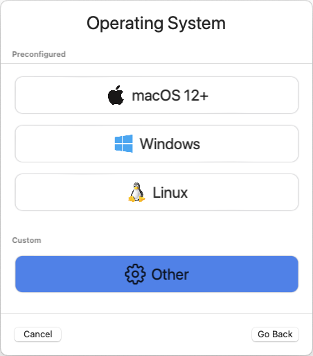
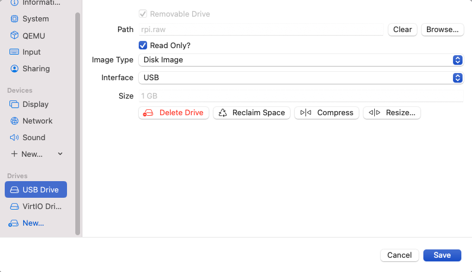

# Intro
## Elemental

Via the [official docs](https://elemental.docs.rancher.com/):

> Elemental is a software stack enabling a centralized, full cloud-native OS management with Kubernetes.
> 
> The Elemental Stack consists of some packages on top of SLE Micro for Rancher:
> 
> * elemental-toolkit - includes a set of OS utilities to enable OS management via containers. Includes dracut modules, bootloader configuration, cloud-init style > configuration services, etc.
> * elemental-operator - this connects to Rancher Manager and handles MachineRegistration and MachineInventory CRDs
> * elemental-register - this registers machines via machineRegistrations and installs them via elemental-cli
> * elemental-cli - this installs any elemental-toolkit based derivative. Basically an installer based on our A/B install and upgrade system
> * rancher-system-agent - runs on the installed system and gets instructions ("Plans") from Rancher Manager what to install and run on the system
> Cluster Node OSes are built and maintained via container images through the Elemental CLI and they can be installed on new hosts using the Elemental UI plugin for > Rancher Manager or the Elemental CLI.
> 
> The Elemental Operator and the Rancher System Agent enable Rancher Manager to fully control Elemental clusters, from the installation and management of the OS on the > Nodes to the provisioning of new K3s or RKE2 clusters in a centralized way.
> 
> ## What is Elemental Teal ?
> Elemental Teal is the combination of "SLE Micro for Rancher" with the Rancher Elemental stack.
> 
> SLE Micro for Rancher is a containerized and "stripped to the bones" operating system layer. At its core, it only requires grub2, dracut, a kernel, and systemd.
> 
> Its sole purpose is to run Kubernetes (k3s or RKE2), with everything controlled through Rancher Manager.
> 
> Elemental Teal is built in the openSUSE Build Service and available through the openSUSE Registry.

## Elemental on OSX on Apple Silicon

Elemental is a Kubernetes thing, so it only requires a proper cluster up & running. However, in order to provision real clusters and hosts, it requires to perform
some steps such as downloading and customizing an ISO (or an image file) and boot the ISO. This quickstart uses UTM to create a VM and a few steps to create a proper image to boot from.

The trick here is there is no ARM64 image yet, but just a Raspberry Pi one... so that's the one we will use. It is not generic, but it works.

### Prerequisites

* A Kubernetes cluster where Elemental is deployed. Hint, you can use [the K3s on SLE Micro guide](https://suse-edge.github.io/quickstart/k3s-on-slemicro).
* Rancher server configured (server-url set). Hint: you can use [the official Rancher](https://ranchermanager.docs.rancher.com/v2.6/getting-started/quick-start-guides/deploy-rancher-manager/helm-cli) docs or the [create_vm.sh](https://github.com/suse-edge/misc/blob/main/slemicro/create_vm.sh) script for inspiration.
*  Helm
*  jq

### Elemental UI Rancher extension

This is an optional step to enable the Elemental UI extension in Rancher (see [more about Rancher extensions](https://ranchermanager.docs.rancher.com/integrations-in-rancher/rancher-extensions)):

```
helm repo add rancher-charts https://charts.rancher.io/
helm upgrade --create-namespace -n cattle-ui-plugin-system --install ui-plugin-operator rancher-charts/ui-plugin-operator
helm upgrade --create-namespace -n cattle-ui-plugin-system --install ui-plugin-operator-crd rancher-charts/ui-plugin-operator-crd 

# Wait for the operator to be up
while ! kubectl wait --for condition=ready -n cattle-ui-plugin-system $(kubectl get pods -n cattle-ui-plugin-system -l app.kubernetes.io/instance=ui-plugin-operator -o name) --timeout=10s; do sleep 2 ; done

# Deploy the elemental UI plugin
# NOTE: TABs and then spaces...
cat <<- FOO | kubectl apply -f -
apiVersion: catalog.cattle.io/v1
kind: UIPlugin
metadata:
  name: elemental
  namespace: cattle-ui-plugin-system
spec:
  plugin:
    endpoint: https://raw.githubusercontent.com/rancher/ui-plugin-charts/main/extensions/elemental/1.1.0
    name: elemental
    noCache: false
    version: 1.1.0
FOO

# Or
# helm repo add rancher-ui-plugins https://raw.githubusercontent.com/rancher/ui-plugin-charts/main
# helm upgrade --install elemental rancher-ui-plugins/elemental --namespace cattle-ui-plugin-system --create-namespace
```

After a while, the plugin will be shown in the UI as:


### Elemental Operator

Elemental is managed by an operator deployed via Helm as:

```
helm upgrade --create-namespace -n cattle-elemental-system --install --set image.imagePullPolicy=Always elemental-operator oci://registry.opensuse.org/isv/rancher/elemental/dev/charts/rancher/elemental-operator-chart
```

[The values.yaml file have some variables interesting to see](https://github.com/rancher/elemental-operator/blob/main/chart/values.yaml)

After a few seconds you should see the operator pod appear on the `cattle-elemental-system` namespace:

```
kubectl get pods -n cattle-elemental-system
NAME                                  READY   STATUS    RESTARTS   AGE
elemental-operator-64f88fc695-b8qhn   1/1     Running   0          16s
```

### Kubernetes resources

Based on the [Elemental quickstart](https://elemental.docs.rancher.com/quickstart-cli) guide, a few Kubernetes resources need to be created.

**NOTE:** It is out of the scope of this document to provide an explanation about the resources managed by Elemental, however the [official documentation](https://elemental.docs.rancher.com/machineregistration-reference) explains all those in good detail.

```
cat <<- EOF | kubectl apply -f -
apiVersion: elemental.cattle.io/v1beta1
kind: MachineInventorySelectorTemplate
metadata:
  name: my-machine-selector
  namespace: fleet-default
spec:
  template:
    spec:
      selector:
        matchExpressions:
          - key: location
            operator: In
            values: [ 'europe' ]
EOF

cat <<- EOF | kubectl apply -f -
kind: Cluster
apiVersion: provisioning.cattle.io/v1
metadata:
  name: my-cluster
  namespace: fleet-default
spec:
  rkeConfig:
    machineGlobalConfig:
      etcd-expose-metrics: false
      profile: null
    machinePools:
      - controlPlaneRole: true
        etcdRole: true
        machineConfigRef:
          apiVersion: elemental.cattle.io/v1beta1
          kind: MachineInventorySelectorTemplate
          name: my-machine-selector
        name: pool1
        quantity: 1
        unhealthyNodeTimeout: 0s
        workerRole: true
    machineSelectorConfig:
      - config:
          protect-kernel-defaults: false
    registries: {}
  kubernetesVersion: v1.24.8+k3s1
EOF

cat <<- 'EOF' | kubectl apply -f -
apiVersion: elemental.cattle.io/v1beta1
kind: MachineRegistration
metadata:
  name: my-nodes
  namespace: fleet-default
spec:
  config:
    cloud-config:
      users:
        - name: root
          passwd: root
    elemental:
      install:
        reboot: true
        device: /dev/vda
        debug: true
        disable-boot-entry: true
      registration:
        emulate-tpm: true
  machineInventoryLabels:
    manufacturer: "${System Information/Manufacturer}"
    productName: "${System Information/Product Name}"
    serialNumber: "${System Information/Serial Number}"
    machineUUID: "${System Information/UUID}"
EOF
```

This creates a `MachineRegistration` object which will provide a unique URL which will be used with `elemental-register` to register the node during installation, so the operator can create a `MachineInventory` which will be using to bootstrap the node. See that the label has been see to match the selector here already, although it can always be added later to the `MachineInventory`.


**NOTE:** At this point the x86_64 and ARM64 quickstart differs because for x86_64 there is a `SeedImage` object that needs to be created and that doesn't exist for ARM64 (yet).

### Preparing the installation image

Elemental's support for Raspberry Pi is primarily for demonstration purposes at this point. Therefore the installation process is modelled similar to x86-64. You boot from a seed image (USB stick in this case) and install to a storage medium (SD-card for Raspberry Pi).

**NOTE:** The steps below should to be ran in a linux machine (`SLE Micro` for example).

First step is to download the `machineregistration` object that will instruct where to get the config for the node to be installed:

```
curl -k $(kubectl get machineregistration -n fleet-default my-nodes -o jsonpath="{.status.registrationURL}") -o livecd-cloud-config.yaml
```


Then, the `rpi.raw` image is downloaded and checked the integrity just to be safe:

```
curl -Lk https://download.opensuse.org/repositories/isv:/Rancher:/Elemental:/Stable:/Teal53/images/rpi.raw -o rpi.raw
curl -Lk https://download.opensuse.org/repositories/isv:/Rancher:/Elemental:/Stable:/Teal53/images/rpi.raw.sha256 -o rpi.raw.sha256
sha256sum -c rpi.raw.sha256
```

Finally, the `livecd-cloud-config.yaml` file is injected in the vanilla `rpi.raw` image:

```
IMAGE=rpi.raw
DEST=$(mktemp -d)
SECTORSIZE=$(sfdisk -J ${IMAGE} | jq '.partitiontable.sectorsize')
DATAPARTITIONSTART=$(sfdisk -J ${IMAGE} | jq '.partitiontable.partitions[1].start')

mount -o rw,loop,offset=$((${SECTORSIZE}*${DATAPARTITIONSTART})) ${IMAGE} ${DEST}
mv livecd-cloud-config.yaml ${DEST}/livecd-cloud-config.yaml
umount ${DEST}
```

**NOTE:** The `rpi.raw` image has two partitions. `RPI_BOOT` contains the boot loader files and `COS_LIVE` the Elemental files, where the `livecd-cloud-config.yaml` file needs to be copied.
The easiest way to run a K3s HA cluster is by installing a first node using the `--cluster-init` flag and then, start adding nodes.

### UTM VM

Then, a new UTM VM needs to be created and the `rpi.raw` file configured as USB.




Map the raw file as an ISO and configure the hardware as you please:


Set a proper name:


Finally, it is needed to configure the raw disk as USB:




**NOTE:** The operating system disk device should be the first one, then the USB, so the USB will boot just once as a fallback.

After a while, a new `machineinventory` host will be present:

```
kubectl get machineinventory -n fleet-default m-ed0a3f46-d6f8-4737-9884-e3a898094994 -o yaml

apiVersion: elemental.cattle.io/v1beta1
kind: MachineInventory
metadata:
  annotations:
    elemental.cattle.io/registration-ip: 192.168.205.106
  creationTimestamp: "2023-05-03T14:04:56Z"
  generation: 1
  labels:
    machineUUID: ec49ff2a-e14f-42bf-8098-4162f14ee1f9
    manufacturer: QEMU
    productName: QEMU-Virtual-Machine
    serialNumber: Not-Specified
  name: m-ed0a3f46-d6f8-4737-9884-e3a898094994
  namespace: fleet-default
  resourceVersion: "15848"
  uid: 79608121-034d-4d64-8b48-6624607bbadd
spec:
  tpmHash: a2e5b231dac4e90151454e2ebc76a6b118f7d1b826b810d22868b2d09b38b7f7
status:
  conditions:
  - lastTransitionTime: "2023-05-03T14:07:45Z"
    message: plan successfully applied
    reason: PlanSuccessfullyApplied
    status: "True"
    type: Ready
  - lastTransitionTime: "2023-05-03T14:04:56Z"
    message: Waiting to be adopted
    reason: WaitingToBeAdopted
    status: "False"
    type: AdoptionReady
  plan:
    checksum: 44136fa355b3678a1146ad16f7e8649e94fb4fc21fe77e8310c060f61caaff8a
    secretRef:
      name: m-ed0a3f46-d6f8-4737-9884-e3a898094994
      namespace: fleet-default
    state: Applied
```

Finally, labeling the `machineinventory` of the discovered new host will trigger the installation:

```
kubectl -n fleet-default label machineinventory $(kubectl get machineinventory -n fleet-default --no-headers -o custom-columns=":metadata.name") location=europe
```


```
kubectl get cluster -n fleet-default
NAME         READY   KUBECONFIG
my-cluster   true    my-cluster-kubeconfig
```

Profit!

```
kubectl get secret -n fleet-default my-cluster-kubeconfig -o jsonpath='{.data.value}' | base64 -d >> ~/my-cluster-kubeconfig

KUBECONFIG=~/my-cluster-kubeconfig kubectl get nodes
NAME                                     STATUS   ROLES                              AGE     VERSION
m-ed0a3f46-d6f8-4737-9884-e3a898094994   Ready    control-plane,etcd,master,worker   6m25s   v1.24.8+k3s1

KUBECONFIG=~/my-cluster-kubeconfig kubectl get pods -A
NAMESPACE             NAME                                                              READY   STATUS      RESTARTS   AGE
cattle-fleet-system   fleet-agent-7ffcdff7c5-2rvvl                                      1/1     Running     0          2m47s
cattle-system         apply-system-agent-upgrader-on-m-ed0a3f46-d6f8-4737-9884-1jhpkx   0/1     Completed   0          2m1s
cattle-system         cattle-cluster-agent-684c4687c8-scgvb                             1/1     Running     0          61s
cattle-system         helm-operation-hjkcr                                              0/2     Completed   0          5m35s
cattle-system         rancher-webhook-85bb446df8-r8g6r                                  1/1     Running     0          5m22s
cattle-system         system-upgrade-controller-65bcf49944-rp2gr                        1/1     Running     0          2m47s
kube-system           coredns-7b5bbc6644-2zdlk                                          1/1     Running     0          6m20s
kube-system           helm-install-traefik-crd-ksm4q                                    0/1     Completed   0          61s
kube-system           helm-install-traefik-kg4qv                                        0/1     Completed   0          61s
kube-system           local-path-provisioner-687d6d7765-j54vp                           1/1     Running     0          6m20s
kube-system           metrics-server-84f8d4c4fc-6t6kc                                   1/1     Running     0          6m20s
kube-system           svclb-traefik-7ca8393f-gvdcc                                      2/2     Running     0          5m58s
kube-system           traefik-6b8f69d897-bwtgq                                          1/1     Running     0          5m58s
```


